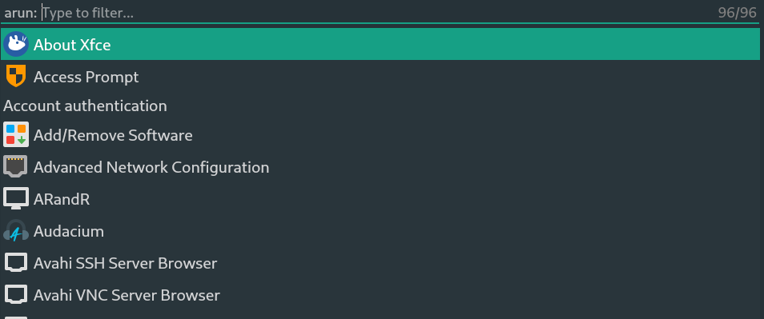

<h1 align="center">emily</h1>

**emily** - GNU/Linux scripts and apps launcher.

Here is a emily interface:

# Installation

1. Install requirments: `pip install -r requirments.txt`

2. Start emily: `sh start.sh`

# Usage

* Start type any text for filter items.

* Press `Tab` for change items list.

* Press `Enter` for launch picked item.